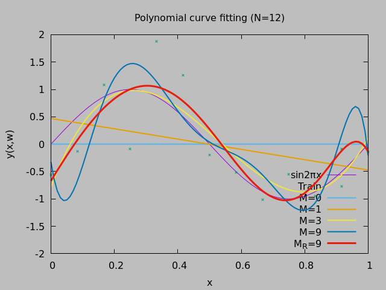

# CL-PLAYGROUND

CLで書いた何か。

##### NABEATSU  
ナベアツ算

##### AUTO-DIFFERENTIAL*  
自動微分(途中)

##### GROUP-THEORY  
群論

##### COVER*  
被覆(途中)

##### PARTICLE  
パーティクル描画(OpenGL)

##### POLYNOMIAL CURVE FITTING
多項式曲線フィッティング

##### PACKT FREE
Packt Free Books Alert

##### K-NN
k-nearest neighbor

##### ID3
Iterative Dichotomiser 3

##### PCA
Principal Component Analysis

##### FORMULA
Reader macro to write a formula as infix notation

##### ASYNC-WS
Asynchronous task alert server and client

##### NLP
Natural language processing in Japanese

##### k-medoids
k-medoids method

##### som
Self-Organizing Map

##### MACRO
Macros

##### TRAIT
Experimental trait macros

##### NAND
Make OR from NAND
